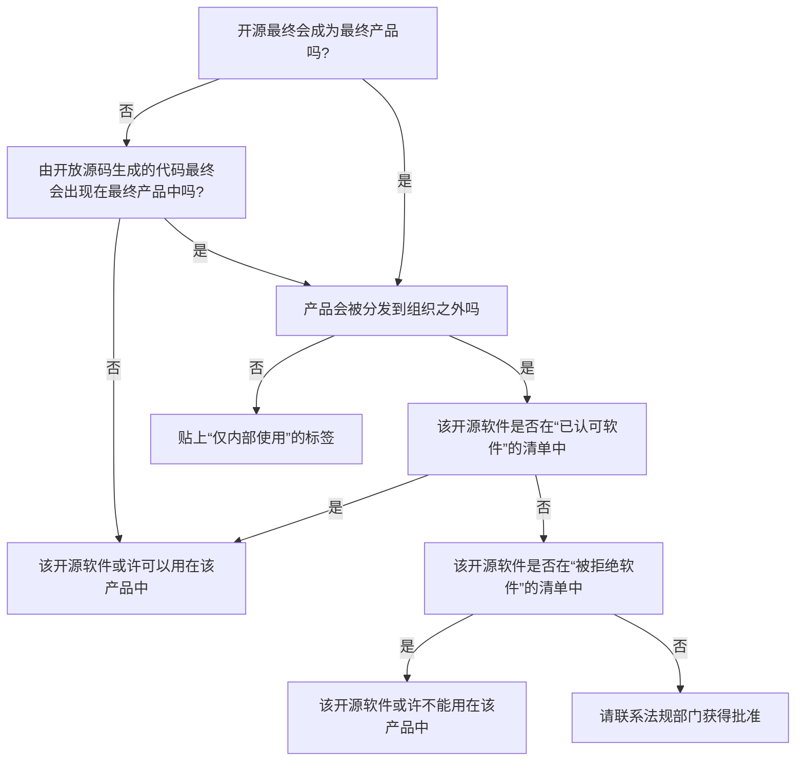

## Flowchart #0 - How Do I Distribute 流程图 #0 -- 我该如何分发

```mermaid
flowchart TD
    A[开源最终会成为最终产品吗?]
    A --> |否| B[由开放源码生成的代码最终会出现在最终产品中吗?]
    A --> |是| C[产品会被分发到组织之外吗]
    B --> |是| C
    C --> |是| D[该开源软件是否在“已认可软件”的清单中]
    C --> |否| E[贴上“仅内部使用”的标签]
    D --> |是| F[该开源软件或许可以用在该产品中]
    B --> |否| F
    D --> |否| G[该开源软件是否在“被拒绝软件”的清单中]
    G --> |是| H[该开源软件或许不能用在该产品中]
    G --> |否| I[请联系法规部门获得批准]
```
