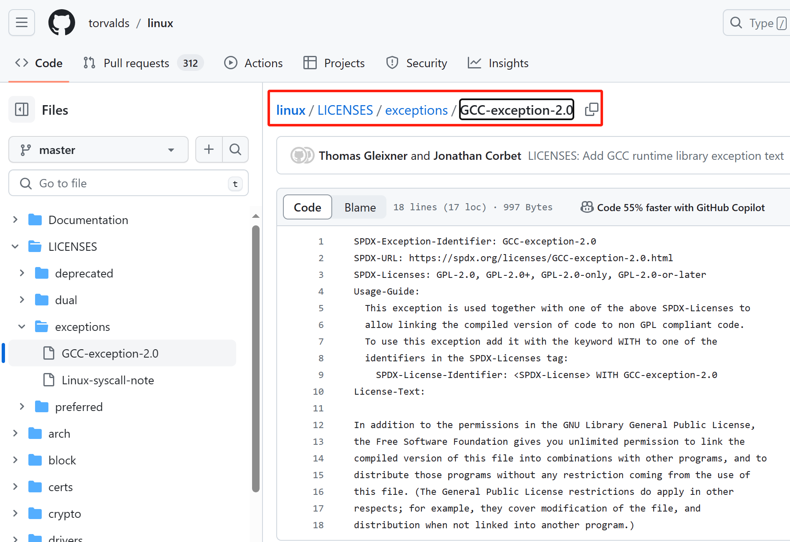
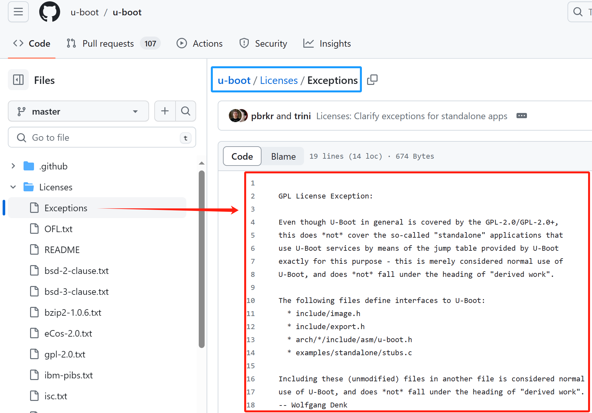

## 开源的关键性例外的内容
在嵌入产品开发及类linux产品的开发过程中，涉及bootloader及linux kernel的关键具有强传染性开源协议GPL系列的产品组件包中，部分内容属于例外。

### linux内核的开源性声明的例外

Linux 内核中的两个重要的 license 例外声明是 linux-syscall-note 和 GCC-exception-2.0。让我们逐个了解它们在开源社区和实际软件生态中的地位以及对开源和其他 Linux 软件生态产品的影响：

#### linux-syscall-note
**地位：** 
这个声明用于指定 Linux 内核的部分代码允许用于用户空间的库或应用程序，同时保留了 Linux 内核的 GPL 许可。

**开源社区中的地位：** 
这个声明被认为是极其重要的，因为它允许用户空间的应用程序能够与 Linux 内核交互，而无需担心与内核许可证冲突。这在开发用户空间工具和库的过程中起到了关键作用。

**现实意义：** 
对于开发人员和公司来说，这意味着他们可以开发与 Linux 内核交互的工具和库，无需担心由于许可证问题而被迫开源他们的整个产品。
影响： 这使得开发用户空间工具和库的门槛降低，促进了更多与 Linux 内核集成的开发活动，从而增强了 Linux 生态系统的健康发展。

**linux syscall note**
[Linux-syscall-note](https://github.com/torvalds/linux/blob/master/LICENSES/exceptions/Linux-syscall-note)

**中文译文（仅作参考）**
>
> SPDX-Exception-Identifier: Linux-syscall-note
> SPDX-URL: https://spdx.org/licenses/Linux-syscall-note.html
> SPDX-Licenses: GPL-2.0, GPL-2.0+, GPL-1.0+, LGPL-2.0, LGPL-2.0+, LGPL-2.1, LGPL-2.1+, GPL-2.0-only, GPL-2.0-or-later
> 
> **使用指南:**
> 此例外与上述spdx许可之一一起用于标记用户空间API (uapi)头文件，以便它们可以包含在非GPL兼容的用户空间应用程序代码中。
> 要使用此异常，将其与关键字with一起添加到SPDX-Licenses标签中的标识符之一:
SPDX-License- identifier: <SPDX-License> WITH linux-sycall-note
> 
> **License-Text:**
> 注意!该版权不包括通过正常系统调用使用内核服务的用户程序——这仅仅被认为是对内核的正常使用，并且不属于“派生作品”的标题。
> 还要注意，下面的GPL由自由软件基金会(Free Software Foundation)拥有版权，但是它所引用的代码实例(Linux内核)的版权由我和其他实际编写它的人拥有。
> 还要注意，就内核而言，唯一有效的GPL版本是这个特定版本的许可证(即v2，而不是v2.2或v3.X或其他)，除非另有明确说明。
>

#### GCC-exception-2.0：
**地位：**
这个例外声明适用于使用 GNU 编译器套件（GCC）的代码，允许将被它所覆盖的代码链接到 GCC 生成的代码中，而不会受到 GPL 许可证的限制。
开源社区中的地位： GCC-exception-2.0 对于与 GCC 结合使用的许多项目来说是至关重要的，因为它们可以使用 GCC 编译器而不会受到 GPL 许可证的限制。
现实意义： 对于使用 GCC 的开发人员和组织来说，这个例外声明为他们提供了更大的灵活性，允许他们将自己的代码与 GCC 生成的代码链接而不必担心 GPL 许可证的要求。

**影响：**
这使得开发人员可以更自由地选择使用 GCC，而不必担心因为 GPL 许可证而限制了他们的代码用途。这也有助于促进了 GCC 的广泛应用，因为它可以与许多不同类型的项目集成，从而增强了 GCC 在开源和商业领域的地位。
总的来说，这两个 license 例外声明在开源社区和实际软件生态中都扮演着至关重要的角色。它们降低了开发者的法律风险，促进了更多与 Linux 内核和 GCC 编译器集成的开发活动，从而推动了整个开源生态系统的发展。

**GCC-exception-2.0原始出处**
[GCC-exception-2.0](https://github.com/torvalds/linux/blob/master/LICENSES/exceptions/GCC-exception-2.0)

**中文译文（仅作参考）**
> SPDX-Exception-Identifier: GCC-exception-2.0
> SPDX-URL: https://spdx.org/licenses/GCC-exception-2.0.html
> SPDX-Licenses: GPL-2.0, GPL-2.0+, GPL-2.0-only, GPL-2.0-or-later
>
> **使用指南:**
> 此例外与上述spdx许可证之一一起使用，以允许将编译版本的代码链接到不符合GPL的代码。
>要使用此异常，将其与关键字with一起添加到SPDX-Licenses标签中的标识符之一:
>SPDX-License- identifier: <SPDX-License> WITH GCC-exception-2.0
>
> **License-Text:**
> 除了GNU库通用公共许可证中的许可之外，自由软件基金会还授予您无限制的权限，可以将此文件的编译版本与其他程序组合在一起，并且可以不受使用此文件的任何限制地分发这些程序。(通用公共许可证的限制在其他方面也适用;例如，它们涵盖了文件的修改，以及未链接到另一个程序的分发。)

### u-boot中的开源性声明的例外

**u-boot license例外声明的地位：**
u-boot的默认许可证是GPL，但它还包含一个 license 例外声明，允许u-boot与其他代码一起链接而不受GPL的限制。
这个例外声明为开发者提供了更大的灵活性，使他们能够将 u-boot 与不同许可证的代码集成到嵌入式系统中，而不必担心许可证的冲突。

**在开源社区中的地位：**
在开源社区中，u-boot的license例外声明被视为非常重要的因素，因为它使得u-boot可以与各种其他开源项目一起使用，而无需考虑许可证的限制。
这种灵活性为嵌入式系统的开发者和制造商提供了更多选择，他们可以根据需要选择合适的组件，并将它们整合到他们的产品中，而不必担心许可证问题。

**对开源的现实意义：**
u-boot 的 license 例外声明使得开源项目更易于与 u-boot 集成，这有助于促进嵌入式系统领域的开源发展。
开源项目可以利用 u-boot 的灵活性，将其作为启动加载程序，从而使得项目更易于被采用和整合到更广泛的嵌入式生态系统中。

**总体影响：**
u-boot 的 license 例外声明对嵌入式系统和设备的生态系统有着深远的影响。它促进了不同项目之间的协作与整合，使得开发者可以更轻松地构建出复杂的嵌入式系统。
此外，u-boot 的灵活性也为嵌入式设备的制造商提供了更多选择，他们可以更自由地选择与其硬件兼容的软件组件，而无需担心许可证限制。
综上所述，u-boot 的 license 例外声明在开源社区和实际软件生态系统中具有重要地位，为开发者和制造商提供了灵活性和选择，同时促进了开源嵌入式系统的发展和整合。

[u-boot license exception](https://github.com/u-boot/u-boot/blob/master/Licenses/Exceptions)

**中文译文（仅作参考）**
与本程序一起链接的代码可以遵循任何许可证规定，只要其自身的许可证允许这样做，并且在本程序的二进制形式和/或源代码形式中使用、修改和重新发布的代码不会受到以下条款的限制：
1. 作为修改的源代码，必须包含上述版权声明、本条件列表和以下免责声明。
2. 作为修改后的二进制文件，必须包含上述版权声明、本条件列表和以下免责声明。
3. 该软件由原作者和贡献者提供。本软件仅按“原样”提供，不提供任何形式的明示或暗示保证，包括但不限于销售性和适用性的暗示保证。在任何情况下，作者或版权持有人均不承担任何责任，无论是因使用本软件还是与本软件相关的其他交易引起的、在合同行为、侵权行为或其他方面的诉讼中的诉讼，无论是在该诉讼中的什么原因，即使已被告知这种损害的可能性。