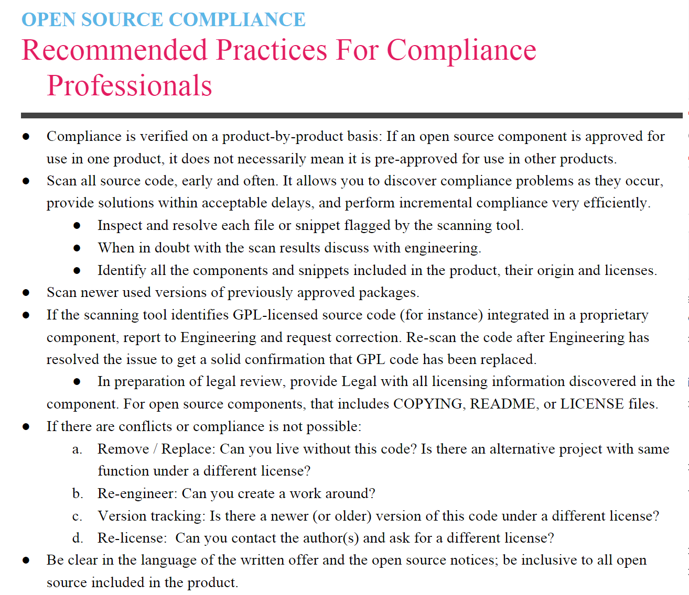
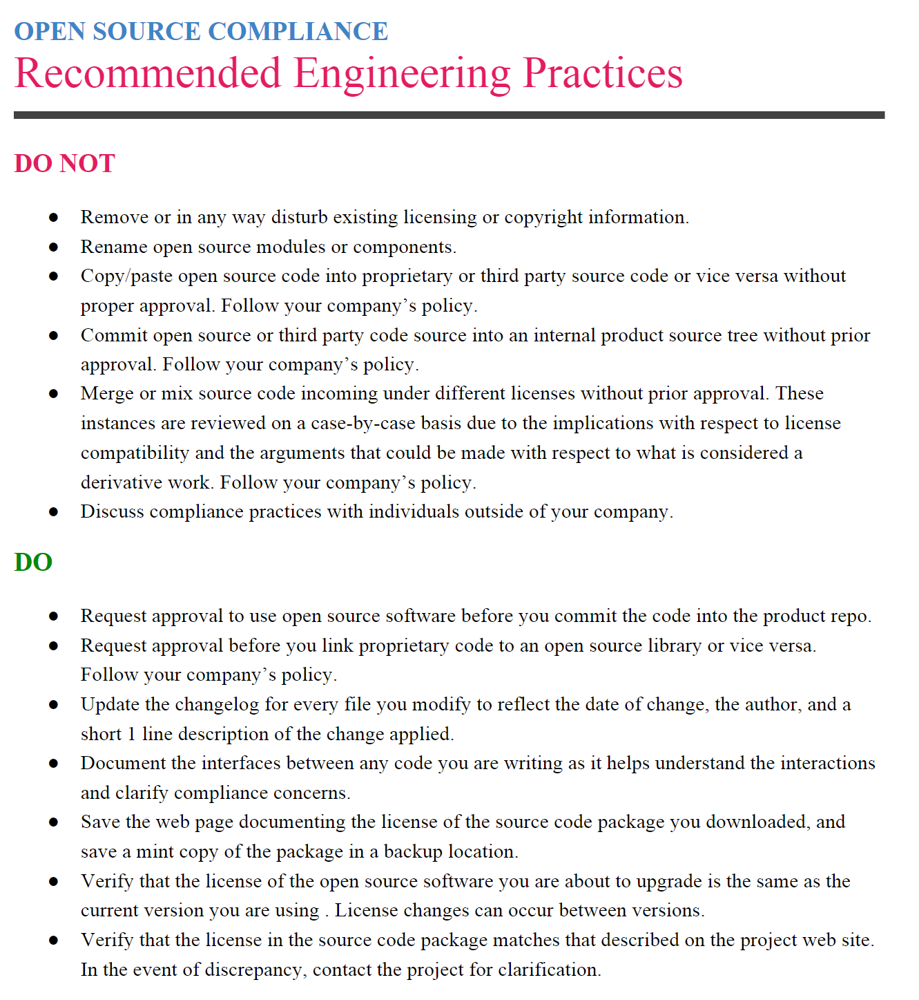

[专业合规性的推荐实践（源自OpenChain-Project） RecommendedPractices-For-Compliance-Professionals](https://github.com/OpenChain-Project/Reference-Material/tree/master/General-Compliance-Support-Material/Recommended%20Practices-For-Compliance-Professionals/en)

[推荐工程实践（源自OpenChain-Project）Recommended-Engineering-Practices](https://github.com/OpenChain-Project/Reference-Material/tree/master/General-Compliance-Support-Material/Recommended-Engineering-Practices/en)
