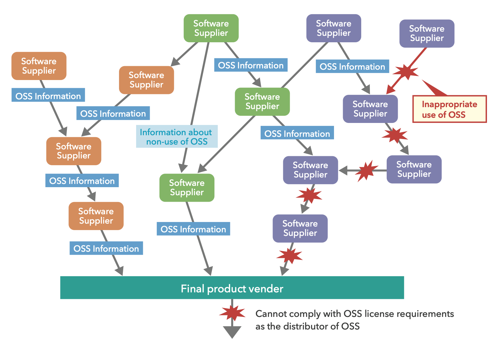

# Supply Chain Education Leaflet
# 供应链教育手册

## From The OpenChain Project
## 源自OpenChain项目
**OpenChain，个人将其翻译为“开放供应链”**

#### First Edition - May 2019 (as 'Open Source Software License Compliance General Public Guide')   第一版- 2019年5月(作为“开源软件许可证合规一般公众指南”)

#### (Draft) Second Edition - February 2024    (草案)第二版- 2024年2月

##### Adjusted OSS to open source as per normal project practice, adjusted intro to mention security, improved introduction, OpenChain certification description, OpenChain Project explanation, SPDX Project explanation, added table of contents, updated Reciprocal licenses section.
##### 按照正常的项目实践调整OSS为开源，调整介绍提到安全，改进介绍，OpenChain认证描述，OpenChain项目解释，SPDX项目解释，增加目录，更新互惠许可部分。

## Contents 目录
- [Introduction介绍](#introduction介绍)
- [Learning open source学习开源](#learning-open-source学习开源)
- [Receiving the benefits of open source享受开源的好处](#receiving-the-benefits-of-open-source享受开源的好处)
- [Risks caused by failure to 不遵守导致的风险](#risks-caused-by-failure-to-comply不遵守导致的风险)
- [Supply chain issues供应链问题](#supply-chain-issues供应链问题)
- [Delivery of open source 开源软件的交付](#delivery-of-open-source-software开源软件的交付)

# Introduction介绍

This leaflet is designed to help companies in the supply chain manage Open Source Software (open source). It was created by the OpenChain Japan Work Group and is maintained by the OpenChain Project global community. The OpenChain Project maintains OpenChain ISO/IEC 5230:2020 for open source license compliance and OpenChain ISO/IEC 18974:2023 for open source security assurance. These standards can help companies manage open source. You can learn more about the OpenChain Project and its standards at [www.openchainproject.org](https://www.openchainproject.org).

本手册旨在帮助供应链中的公司管理开源软件(Open Source)。它是由OpenChain日本工作组创建的，由OpenChain项目全球社区维护。OpenChain项目维护了OpenChain ISO/IEC 5230:2020的开源许可合规性和OpenChain ISO/IEC 18974:2023的开源安全保证。这些标准可以帮助公司管理开源。您可以在[www.openchainproject.org](https://www.openchainproject.org)了解更多关于开放链项目及其标准的信息。

Open source has become essential to modern software development and is incorporated into almost every electronic product, including supercomputers, cloud servers, personal computers, consumer electronics, automobiles, industrial equipment and IoT equipment. Open source is an indispensable part of helping companies to bring high quality products or services to market quickly under intense competition.
开源已经成为现代软件开发的关键，几乎被纳入所有电子产品，包括超级计算机、云服务器、个人电脑、消费电子产品、汽车、工业设备和物联网设备。在激烈的竞争中，开源是帮助公司将高质量的产品或服务快速推向市场不可或缺的一部分。

Much open source is developed through the collaboration of expert developers from different organizations throughout the world. Open source is often a vehicle for advanced innovation in various fields. Software engineers who participate in open source development have opportunities to improve their skills and to experience this innovation firsthand.
许多开放源代码是通过来自世界各地不同组织的专家开发人员的协作开发的。开源通常是各个领域先进创新的载体。参与开源开发的软件工程师有机会提高他们的技能，并亲身体验这种创新。

Open source can be used, modified, and distributed by anyone who complies with the associated license conditions. When open source is distributed, the distributor is required to comply with the terms and conditions of the license at the point in time when distribution occurs. There have been cases where distributors were sued and lost because they failed to satisfy their legal obligations. There are best practices to help prevent this happening.
任何遵守相关许可条件的人都可以使用、修改和分发开放源代码。当开源被分发时，分发者被要求在分发发生时遵守许可证的条款和条件。经销商因未能履行法律义务而被起诉并败诉的案例也不少。有一些最佳实践可以帮助防止这种情况的发生。

By the same token, similar to all other software, security issues sometimes occur around open source. By managing open source it is possible to prevent and address many of these issues before they become a concern. The key thing is for all relevant personnel to have an understanding of the basic principles of open source.
出于同样的原因，与所有其他软件类似，开源有时也会出现安全问题。通过管理开源，可以在这些问题成为关注焦点之前预防和解决它们。关键是所有相关人员都要了解开源的基本原则。

This leaflet is licensed under [CC0-1.0](https://creativecommons.org/public-domain/cc0/) (effectively public domain). You can use, share, study and alter it without restriction.
本手册在CC0-1.0(有效的公共领域)下授权。你可以不受限制地使用、分享、学习和修改它。

# Learning Open Source学习开源

### Let’s learn the basics of open source 让我们学习开源的基础知识

This pamphlet explains the following:
本小册子介绍以下内容:

1． What is Open Source?
1． 什么是开源?

2． What you need to do to receive the benefits of open source
2． 您需要做什么才能获得开源的好处

3． Risks associated with failure to comply with open source obligations
3． 与未能遵守开放源代码义务相关的风险

Unfortunately, there have been cases where a company’s failure to comply with their open source license obligations resulted in successful litigation by the copyright holder.
不幸的是，在某些情况下，公司未能遵守其开源许可义务导致版权所有者成功提起诉讼。

4． Supply chain issues
4． 供应链问题

5． What you need to do to ensure that everyone benefits from open source.
5． 您需要做些什么来确保每个人都从开源中受益

Points 3 and 4 may be intertwined. If open source is acquired through a supply chain then all links in the supply chain must comply with the conditions of the license. If any link fails to satisfy the conditions of the license, then entities later in the supply chain will not be able to remedy the missing conditions. An employee or company acting alone cannot meet all the responsibilities and requirements by themselves.
第3点和第4点可能交织在一起。如果开源是通过供应链获得的，那么供应链中的所有环节都必须遵守许可证的条件。如果任何一个环节不满足许可证的条件，那么供应链后面的实体将无法弥补缺失的条件。员工或公司不能单独履行所有的责任和要求。

When an item with open source software is delivered to another party, information related to all included open source must be provided. The following staff are required to know the proper procedures to follow when acquiring and distributing open source:
当一个带有开源软件的项目交付给另一方时，必须提供与所有包含的开源相关的信息。下列职员在获取和分发开放源代码时，必须知道应遵循的适当程序:

- Developers and engineers: In addition to software developers, hardware engineers are deeply involved in developing device driver software, board support packages (BSP) and software development kits (SDKs) for their hardware.
- Procurement personnel: Open source may be included in deliverables from the supply chain, such as software, hardware modules, SoCs, semiconductor products, and products designed and developed by ODM/OEM manufacturers.
- Sales personnel: Sales personnel are required to understand the reasons that customers need the open source-related information, including copyright and license information.
- Quality assurance personnel: Open source that is included in a product may affect its quality or introduce bugs. QA personnel need to be aware of such issues.
- Legal/Intellectual Property personnel: Legal and intellectual property personnel are required to know the laws, legal precedents, and legal remedies that relate to open source license interpretation and adherence.
- Executives and managers: Executives and managers develop strategy around using, contributing to, and distributing Open Source; build teams to promote open source usage; and oversee open source processes, and investment in required software tools.
- Security Personnel: Open source that is included in a product may be referenced in published security disclosures. Security personnel need to know the included open source that they can track exposure to any existing or newly-discovered vulnerabilies.
- 开发人员和工程师:除了软件开发人员外，硬件工程师还深入参与开发设备驱动程序软件，电路板支持包(BSP)和软件开发工具包(sdk)。
- 采购人员：开源可能包含在供应链的可交付成果中，例如软件、硬件模块、soc、半导体产品以及ODM/OEM制造商设计和开发的产品。
- 销售人员：要求销售人员了解客户需要开源相关信息的原因，包括版权和许可信息。
- 质量保证人员：产品中包含的开放源代码可能会影响其质量或引入错误。QA人员需要意识到这些问题。
- 法律/知识产权人员：法律和知识产权人员需要了解与开放源代码许可解释和遵守相关的法律、法律先例和法律补救措施。
- 执行人员和管理人员：执行人员和管理人员围绕使用、贡献和分发开源制定策略;建立团队来促进开源的使用;并监督开源过程，以及对所需软件工具的投资。
- 安全人员：产品中包含的开放源代码可以在发布的安全披露中引用。安全人员需要知道所包含的开放源代码，以便他们可以跟踪对任何现有或新发现的漏洞的暴露。

*ODM: Original Design Manufacturer, 原始设计制造商   
*OEM: Original Equipment Manufacturer, 原始设备制造商

## Definition of open source 开源的定义

It is not easy to answer precisely “What is open source?”. Different people have different answers. However, most people would agree with the following: 
要准确地回答“什么是开源?”并不容易。不同的人有不同的答案。然而，大多数人会同意以下观点:

Open source is software for which the source code is provided. And the copyright holder allows others to use, inspect, modify, and share the software. 
开放源码是指为其提供源代码的软件。版权所有者允许其他人使用、检查、修改和共享该软件。

## Examples of open source 开源的例子

Linux is probably the most widely known example of open source. An Operating System (OS) is software that is designed to provide a platform for other software. Linux is one such operating system. Linux is everywhere. It is incorporated into almost every major computing system, including supercomputers, stock exchange servers, Internet servers, smartphones using the Android software stack, consumer electronics products, automobiles, and industrial equipment. Linux supports a large portion of the world’s core technological infrastructure.
Linux可能是最广为人知的开源示例。操作系统(OS)是为其他软件提供平台而设计的软件。Linux就是这样一个操作系统。Linux无处不在。它几乎被整合到每一个主要的计算系统中，包括超级计算机、证券交易所服务器、互联网服务器、使用Android软件栈的智能手机、消费电子产品、汽车和工业设备。Linux支持世界上大部分的核心技术基础设施。

Linux has been developed through the collaboration of tens of thousands of developers from around the world. Linux development continues actively every day. Anyone can freely use, modify and distribute Linux, provided they abide by the conditions of the license that the Linux developers have chosen. It is very important that companies that use Linux understand and comply with the license terms for Linux.
Linux是由来自世界各地的成千上万的开发人员合作开发的。Linux的开发每天都在积极进行。任何人都可以自由地使用、修改和分发Linux，只要他们遵守Linux开发人员所选择的许可条件。使用Linux的公司理解并遵守Linux的许可条款是非常重要的。

In addition to Linux, there are a huge number of other open source projects. These include the Apache project used for HTTP servers, the widely used compiler GNU Compiler Collection (GCC), and the Eclipse integrated development environment, to name just a few.
除了Linux之外，还有大量的其他开源项目。其中包括用于HTTP服务器的Apache项目、广泛使用的编译器GNU compiler Collection (GCC)和Eclipse集成开发环境，仅举几例。

## Open source and licenses 开源和许可

A copyright holder of open source does not waive their copyright in the code, but grants users certain rights to the software based on the user’s adherence to the conditions of the software’s license. In some cases, a copyright holder may grant users a patent license. It is critical for users of open source to understand the license of each piece of open source they use.
开放源代码的版权所有者不会放弃他们在代码中的版权，而是根据用户对软件许可条件的遵守，授予用户对软件的某些权利。在某些情况下，版权所有者可能会授予用户专利许可。对于开源用户来说，了解他们使用的每个开源软件的许可证是至关重要的。

Almost all open source licenses disclaim liability for open source developers. In almost all cases, the open source developers do not take responsibility for usage of open source; but require users, product integrators, and vendors to take this responsibility on themselves.
几乎所有的开源许可证都不承担开源开发者的责任。在几乎所有的情况下，开源开发者不承担使用开源的责任;但是需要用户、产品集成商和供应商自己承担这个责任。

Not all software is covered by copyright. If you need to judge whether a particular piece of open source is copyrighted material or not, you should consult with a lawyer or intellectual property expert.
并非所有软件都受版权保护。如果您需要判断某个特定的开放源代码是否是受版权保护的材料，您应该咨询律师或知识产权专家。

## What is granted by licenses (copyright) 许可证授予的内容(版权)

With some open source licenses, the copyright holder grants others the right to use or distribute the software. This license grant occurs without direct communication between the copyright holder and the user, but this right-of-use is only granted if the user adheres with conditions provided by the copyright holder in the license. When a user fails to comply with these license conditions, a serious issue arises.
对于一些开源许可，版权所有者授予其他人使用或分发该软件的权利。这种许可的授予不需要版权所有者和用户之间的直接沟通，但是只有当用户遵守版权所有者在许可中提供的条件时，这种使用权才会被授予。当用户不能遵守这些许可条件时，就会出现严重的问题。

## What is granted by licenses (patents) 许可(专利)授予什么

With some open source licenses, the copyright holder of open source grants others the right to freely use the patents that are practiced by the software and owned by the copyright holder. Not every open source license grants such a patent license. Examples of licenses that include such patent grants are the Apache license, and the GNU General Public License (GPL) version 3. 

对于一些开源许可证，开源软件的版权持有者授予其他人自由使用软件实践中由版权持有者拥有的专利的权利。并不是每个开源许可证都授予这样的专利许可证。包含此类专利授权的许可证示例是Apache许可证和GNU通用公共许可证(GPL)版本3。

## Typical open source licenses 典型的开源许可证

The Open Source Initiative (OSI) is an organization that promotes open source. It defines the criteria for what constitutes open source and approves dozens of different licenses as valid open source licenses.
开放源码倡议(OSI)是一个促进开放源码的组织。它定义了构成开放源码的标准，并批准了数十种不同的许可证作为有效的开放源码许可证。

[https://opensource.org/licenses](https://opensource.org/licenses)
[https://opensource.org/osd](https://opensource.org/osd)

当一个网页被转移到用户的机器上时，可能会发生一个有趣的开源发布案例。

当用户访问页面时，包含在web页面中的JavaScript作为页面数据的一部分从web服务器传输到用户机器上的浏览器。如果JavaScript程序是开源的，那么这就构成了发布，许可证条款将适用。

分发开源时应履行的义务
在分发开源时，需要履行的义务因许可证而异。确定所发布的产品或程序中的所有开源和相关许可证是很重要的。

这是为了清楚地了解必须满足的所有不同许可条款。

Most open source is licensed under an OSI-approved license. In addition, some software that is licensed under non-OSI-approved licenses may be treated as open source as well. Whether software should be treated as open source is usually determined by agreement between the software supplier and the recipient, potentially using the Open Source Definition (OSD), Free Software Definition (FSD) or similar.
大多数开源软件都是按照osi批准的许可证授权的。此外，一些在非osi许可下许可的软件也可以被视为开源软件。软件是否应被视为开源通常由软件供应商和接收方之间的协议决定，可能使用开源定义(OSD)、自由软件定义(FSD)或类似的定义。

# Receiving the benefits of open source享受开源的好处

### When you use open source, the most important thing to know is your obligations related to distribution of the software. 当你使用开源软件时，最重要的是要知道你与软件发布相关的义务。

Almost all open source licenses define the following:
几乎所有的开源许可证都定义了以下内容:

- The open source developer disclaims liability for the effects of using the software
- Some obligations must be fulfilled when the software is distributed by an individual or legal entity (distributor).
- 开源开发者对使用该软件的影响不承担责任
- 当软件被发布时，必须履行一些义务个人或法人(分销商)。

In the following sections, a distributor can mean either an individual or a legal entity such as a company.
在以下章节中，分销商可以指个人或公司等法律实体。

Anyone who complies with the conditions of the license may freely use and distribute the software.
任何符合许可证条件的人都可以自由地使用和发布该软件。

However, the conditions differ from license to license. Some licenses require only that a license notice and a copyright notice be included in the source publication. Other licenses require the disclosure of the source code and a written offer to obtain it. Some licenses have terms that affect what other open source the first software may be used in combination with. A distributor is required to comply with all of the obligations defined in the license.
但是，不同许可证的条件不同。有些许可只要求在源出版物中包含许可声明和版权声明。其他许可则要求公开源代码，并提供获得源代码的书面要约。有些许可证的条款会影响第一个软件可能与其他开源软件结合使用。分销商必须遵守许可证中规定的所有义务。

## Examples of open source distribution 开源发布的例子

There are several different ways open source may be distributed. In every case, the distributor is required to comply with the open source license.
开源有几种不同的发布方式。在任何情况下，发布者都必须遵守开源许可证。

1. One way to distribute open source is to develop a product using an SDK (software development kit) provided by a semiconductor vendor. If open source that is included in the SDK is incorporated into a product during development, then this means that the semiconductor vendor is distributing open source via inclusion in the SDK, and the product developer is distributing open source via inclusion in the product. In this case, the product vendor has responsibilities to fulfill to comply with the license. But they are dependent on the semiconductor vendor. If the semiconductor vendor does not provide appropriate information about the open source included in the SDK, the product vendor cannot comply with the open source license.

   发布开源软件的一种方法是使用半导体供应商提供的SDK(软件开发工具包)开发产品。如果包含在SDK中的开放源码在开发过程中被合并到产品中，那么这意味着半导体供应商通过包含在SDK中来发布开放源码，而产品开发人员通过包含在产品中来发布开放源码。在这种情况下，产品供应商有责任遵守许可证。但它们依赖于半导体供应商。如果半导体厂商没有提供有关SDK中包含的开放源码的适当信息，产品厂商就不能遵守开放源码许可证。

2. Another way that open source might be distributed is when an ODM or OEM is entrusted with the design and development of a product for manufacturers. The ODM or OEM may incorporate open source into the product, which the product distributor needs to know about.

   开源发布的另一种方式是委托ODM或OEM为制造商设计和开发产品。ODM或OEM可能将开放源代码合并到产品中，产品分销商需要知道这一点。
   Even though an OEM or ODM made the product, the brand owner of the product distributes the open source incorporated into the product. The brand owner is required to comply with the open source license. If the ODM or OEM manufacturer does not provide appropriate information about open source, the brand owner of the product cannot comply with the open source license.
   即使是OEM或ODM制造了产品，产品的品牌所有者也会分发包含在产品中的开放源代码。品牌所有者必须遵守开源许可协议。如果ODM或OEM制造商没有提供适当的开源信息，产品的品牌所有者就不能遵守开源许可证。

3. Other ways of distributing open source include shipping a product, releasing mobile application software, or providing an update of software for a previously shipped device.

   发布开源软件的其他方式还包括发布产品、发布移动应用软件，或者为之前发布的设备提供软件的更新。
   If open source is included in a product, mobile application, or software update, this constitutes distribution of open source. The entity who ships the product or releases the software is required to comply with the open source license.
   如果产品、移动应用程序或软件更新中包含了开源，这就构成了开源的分发。发布产品或发布软件的实体需要遵守开源许可证(open source license)。

4. JavaScript used in web pages constitutes distribution:

   web页面中使用的JavaScript构成了分布:
   An interesting case of open source distribution may occur when a web page is transferred to a user’s machine.
   当一个网页被转移到用户的机器上时，可能会发生一个有趣的开源发布案例。

   JavaScript that is included in web pages is transferred from the web server to the browser on the user’s machine, as part of the page data, when the user accesses the page. If the JavaScript program is open source, then this constitutes distribution and the license terms will apply.
   当用户访问页面时，包含在web页面中的JavaScript作为页面数据的一部分从web服务器传输到用户机器上的浏览器。如果JavaScript程序是开源的，那么这就构成了发布，许可证条款将适用。

## Obligations to be fulfilled when open source is distributed 分发开源时应履行的义务

The obligations that need to be fulfilled when open source is distributed vary from license to license. It is important to identify all of the open source and associated licenses in a product or program that is distributed.
在分发开源时，需要履行的义务因许可证而异。确定所发布的产品或程序中的所有开源和相关许可证是很重要的。

This is required to clearly understand all the different license terms that must be satisfied. 
这是为了清楚地了解必须满足的所有不同许可条款。

## Permissive licenses 宽容协议

The MIT license, the BSD license and the Apache license require few obligations. These licenses require the distribution of the software’s copyright notice and the license text. The notice should be clearly displayed in a place where the person receiving the open source can read it.
MIT许可证、BSD许可证和Apache许可证要求的义务很少。这些许可要求发布软件的版权声明和许可文本。该通知应该清晰地显示在接收开源源代码的人可以阅读的地方。

## Reciprocal licenses 互惠许可

Reciprocal licenses like the GPL, the LGPL, the AGPL and the Mozilla Public License require disclosing the source code of software covered by their terms. They also require the distributor to disclose all source code modifications. This type of license is designed to create a situation where modifications and improvements can be shared by all users and developers of the software.
像GPL、LGPL、AGPL和Mozilla公共许可证这样的互惠许可证要求披露其条款所涵盖的软件源代码。它们还要求分发者公开所有源代码修改。这种类型的许可证旨在创建一种场景，使软件的所有用户和开发人员都可以共享修改和改进。

In addition to disclosure requirements, these licenses have other requirements to be met as well. For example, they also require that license and copyright information must not be removed from the source code. You must understand and follow the requirements of these licenses to distribute software covered by their terms. If needed, you should consult with your legal and intellectual property staff.
除了披露要求外，这些许可证还需要满足其他要求。例如，它们还要求不能从源代码中删除许可证和版权信息。您必须理解并遵循这些许可证的要求，以分发其条款涵盖的软件。如果需要，你应该咨询你的法律和知识产权工作人员。

## Patents that you cannot grant 你不能授予的专利

In some cases, an open source license may require a distributor to grant their users a license for patents embodied in the software that the distributor uses or adds to the open source. If you have such a patent, that you cannot grant your users a license to, you must not distribute open source covered by such license terms.
在某些情况下，开源许可证可能要求分发者为其用户授予包含在分发者使用或添加到开源中的软件中的专利许可证。如果您有这样的专利，您不能授予您的用户许可证，您必须不分发受此类许可证条款覆盖的开源。

# Risks caused by failure to comply不遵守导致的风险

### Litigation by an open source copyright holder against a company for failure to comply with the license has occurred.开源版权持有人对公司不遵守许可证的诉讼已经发生。

Unfortunately, it has occurred that failure to comply with the open source license resulted in litigation against the user (and distributor) by the open source copyright holders. In at least one case, a judgement required the defendant to suspend the shipment of their products containing open source.
不幸的是，如果不遵守开源许可证，就会导致开源版权所有者对用户(和分发者)提起诉讼。在至少一个案例中，判决要求被告暂停运送含有开源的产品。

In December of 2009 there was a lawsuit related to Open Source software called “Busybox”. The Busybox program is widely incorporated into embedded systems and is licensed under the GPL version 2 license. In this case, 14 companies were the subject of the lawsuit, including some in the consumer electronics industry. The remarkable thing about this case was that companies suffered litigation on products that had been made by an ODM manufacturer.
2009年12月，有一起与开源软件“Busybox”有关的诉讼。Busybox程序被广泛地集成到嵌入式系统中，并在GPL version 2许可证下获得许可。在这起案件中，14家公司是诉讼的对象，包括一些消费电子行业的公司。这个案子值得注意的是，公司因ODM制造商生产的产品而遭受诉讼。

In every case, it was the distributor’s failure to comply with the open source license that resulted in the litigation. To avoid litigation, an entity working with open source should:
在每一个案例中，都是由于分发者未能遵守开源许可证而导致诉讼。为了避免诉讼，与开源合作的实体应该:

- Identify every piece of open source in the software to be distributed
- Understand the obligations defined by the open source license, and comply with them.
- 识别要发布的软件中的每一个开源部分
- 理解开源许可证定义的义务，并遵守它们。

## What is lost in litigation 在诉讼中损失了什么

When a company is litigated, one of the largest damages to the company is to its reputation (reputational risk). A bad reputation of not complying with software licenses may cause a company to lose the trust of other companies. The more that a company understands the importance of its trust relationships, and endeavors to build trust throughout its industry, the more serious that company is about avoiding risks to its reputation.
当公司被起诉时，对公司最大的损害之一是其声誉(声誉风险)。不遵守软件许可证的坏名声可能会导致一个公司失去其他公司的信任。一家公司越了解其信任关系的重要性，并努力在整个行业建立信任，该公司就越会认真避免其声誉风险。

To respond to litigation requires a lot of work and expense. In the absence of litigation, the human resources involved in legal, procurement, engineering, and compliance could be used in more constructive tasks. This means that a company spending time responding to litigation might miss out on other business opportunities that those human resources could be working on. In particular, employing a competent lawyer for open source litigation is very expensive.
应付诉讼需要大量的工作和费用。在没有诉讼的情况下，涉及法律、采购、工程和合规的人力资源可以用于更有建设性的任务。这意味着，一个公司花时间应对诉讼可能会错过其他的业务机会，这些人力资源可以工作。特别是，雇佣一个有能力的律师进行开源诉讼是非常昂贵的。

A settlement or a legal judgement may require payment of money or a fine. In the extreme, a judgement could result in the suspension of shipment of a product, which could be quite damaging and costly. 
和解或法律判决可能需要支付金钱或罚款。在极端情况下，判决可能导致产品暂停发货，这可能具有相当大的破坏性和代价。

## Building a good relationship with the open source community 与开源社区建立良好的关系

To reduce the risk of litigation, it is essential to understand open source principles and to comply with the obligations of the open source licenses. In addition, it is highly recommended to contribute to the open source community and to build good relationships with the developers of the open source that you use.
为了降低诉讼风险，理解开源原则和遵守开源许可证的义务是至关重要的。此外，强烈建议你为开源社区做出贡献，并与你使用的开源社区的开发人员建立良好的关系。

If you understand why the authors selected a specific Open Source license for their software, and the intent of the open source community that supports an open source project, it will help you move beyond just fulfilling the letter of the open source license. Understanding the intent of the developers is one of the most important benefits of having a good relationship with the open source community.
如果你理解作者为什么为他们的软件选择一个特定的开源许可证，以及开源社区支持开源项目的意图，它将帮助你超越仅仅履行开源许可证的字面意思。理解开发人员的意图是与开源社区保持良好关系的最重要好处之一。

A good relationship with the open source community may enable a company to have its own new ideas adopted into the open source. The open source community may improve software based on your ideas and requirements. Also, engineers in your company may have the opportunity to collaborate with highly skilled open source developers, and this could result in more satisfaction and skill for your engineers.
与开源社区的良好关系可以使公司将自己的新想法应用到开源中。开源社区可能会根据您的想法和需求改进软件。此外，您公司的工程师可能有机会与技术高超的开源开发人员合作，这可能会为您的工程师带来更高的满意度和技能。

As the system software increases in size and functionality, it becomes more and more complex. It is harder and harder to produce software without bugs. However, if a company has a good relationship with open source developers, the community may help your engineers find and resolve bugs, as the software is developed.
随着系统软件的规模和功能的增加，系统变得越来越复杂。开发出没有bug的软件越来越难了。然而，如果一家公司与开源开发人员有良好的关系，那么在软件开发过程中，社区可能会帮助您的工程师找到并解决bug。

## Contributing to open source communities 为开源社区做出贡献

There are many ways to contribute to open source communities: proposing bugfixes and new features, translating documents, providing places and forums where community members can communicate, and sponsoring and participating in projects and trade associations that support open source, such as The Linux Foundation.
为开源社区做出贡献的方式有很多:建议bug修复和新特性，翻译文档，提供社区成员可以交流的地方和论坛，以及赞助和参与支持开源的项目和行业协会，如Linux基金会。

# Supply chain issues供应链问题

### Open source compliance cannot be achieved by one person acting alone 开源合规性不能由一个人单独实现

As software becomes larger and more complex, the supply chain for software also tends to become larger and more complex. A modern software supply chain may include an open source community, a software supplier, a semiconductor vendor that provides an SDK, and a final product vendor. If any member of a large and complex software supply chain fails to comply with license obligations or fails to provide the appropriate license information, it will cause a large impact to a vendor who is obligated to comply with the license (Figure 1). Compliance failure could result in product shipment being suspended. If the vendor does not know about the failure before shipping, the vendor may receive an inquiry regarding the failure from a copyright holder or a third party, which it cannot respond to.
随着软件变得越来越大、越来越复杂，软件供应链也趋向于变得越来越大、越来越复杂。现代软件供应链可能包括一个开源社区、一个软件供应商、一个提供SDK的半导体供应商和一个最终产品供应商。如果大型复杂软件供应链的任何成员未能遵守许可证义务或未能提供适当的许可证信息，将对有义务遵守许可证的供应商造成很大影响(图1)。遵守失败可能导致产品发货被暂停。如果供应商在发货前不知道故障，供应商可能会收到版权持有人或第三方关于故障的询问，但它无法回应。

However, if software compliance is managed appropriately in the upstream supply chain, these problems can be avoided. To facilitate compliance with open source licenses, all participants in the supply chain must do their duty, build trust throughout the supply chain, and communicate appropriate information regarding included software.
然而，如果在上游供应链中对软件遵从性进行了适当的管理，则可以避免这些问题。为了促进遵守开源许可证，供应链中的所有参与者必须履行他们的职责，在整个供应链中建立信任，并就所包含的软件交流适当的信息。

It is recommended that each company in the supply chain establish a program to ensure open source compliance. The OpenChain Project created ISO/IEC 5230:2020 to explain the key requirements of this type of program, and to make it clear that even small teams can address open source compliance cheaply and effectively. At its most basic level, ISO/IEC 5230:2020 helps a company check its compliance process and improve it where necessary based on 30 years of industry knowledge. Free self-certification is available on the OpenChain Project website and there are also options for third-party certification if a company or its customers require it.
建议供应链中的每个公司建立一个计划以确保开源的合规性。OpenChain项目创建了ISO/IEC 5230:2020来解释这类项目的关键要求，并明确表明即使是小型团队也可以廉价有效地解决开源合规问题。在最基本的层面上，ISO/IEC 5230:2020帮助公司检查其合规流程，并根据30年的行业知识在必要时进行改进。OpenChain项目网站上有免费的自我认证，如果公司或客户需要，也可以选择第三方认证。

[Get Certified获取认证](https://www.openchainproject.org/get-started)

## Requirements for participants in the supply chain 供应链参与者的要求

When a supplier distributes software, the supplier is required to provide to each recipient the information that is needed to comply with the open source license. A recipient should review the data and files carefully and verify that they are accurate.
当供应商发布软件时，供应商被要求向每个接收方提供符合开源许可证所需的信息。收件人应仔细检查数据和文件，并核实它们是准确的。

A software distributor may include software from multiple suppliers for a single product. In this case, the distributor is required to receive information about each open source component it receives, along with the software.
软件分发者可能为一个产品包含来自多个供应商的软件。在这种情况下，分发者需要接收它接收到的每个开源组件的信息以及软件。

If information about an open source component is not received, such open source should not be incorporated into a product.
如果没有收到有关开源组件的信息，则不应将此类开源组件合并到产品中。

## Different roles in a company have different responsibilities for open source compliance 公司中的不同角色对遵守开源法规负有不同的责任

### Software developers 软件开发人员

Software developers should manage, record and store the configuration of the software. This includes the following:
软件开发人员应当对软件配置进行管理、记录和存储。其中包括以下内容。

- open source and its license
- Linkage (e.g. libraries used by the software, dynamic or static linkage, etc.)
- Modifications. That is, the technical details of any modifications made to the software.
- 开源及其许可证
- 链接(例如软件使用的库，动态或静态链接等)
- 修改。也就是说，对软件所做的任何修改的技术细节。

These items must be identified and listed. Any time the software configuration changes, the list should be updated. The license may change from one release of software to the next, for a particular project. It is recommended to create and manage the list so that each open source item is easily referenced and reviewed. Some licenses (for example, the GPL license) require a distributor to disclose the source code. It is highly recommended that source control management software is used to track the original source code and any changes to the source code.
这些项目必须加以识别和列出。当软件配置发生变化时，应及时更新配置列表。对于一个特定的项目，许可证可能会在不同的软件版本之间发生变化。建议创建并管理这个列表，以便于引用和查看每个开源项目。有些许可证(例如，GPL许可证)要求分发者公开源代码。强烈建议使用源代码控制管理软件来跟踪原始源代码以及对源代码的任何更改。

### Software procurement personnel 软件采购人员

Software procurement personnel must receive information about any open source in the incoming software, for software engineers to record. Open source may be included in software like the SDK provided by a semiconductor vendor.
软件采购人员必须收到关于任何开源软件的信息，以便软件工程师记录。开源软件可能包含在半导体供应商提供的SDK等软件中。

Procurement personnel are required to pay attention to the software in all the different kinds of deliverables that the company receives.
采购人员需要注意公司收到的所有不同类型的交付件中的软件。

### Sales personnel 销售人员

Sales personnel are required to communicate with customers regarding open source. A customer may have special requirements related to the use of open source. For example, a company may have an open source policy that precludes it from using open source with specific licenses.
要求销售人员与客户就开源进行沟通。客户可能对开源的使用有特殊要求。例如，一个公司可能有一个开源政策，禁止它使用具有特定许可证的开源。

It is important for sales personnel to learn of customers’ requirements regarding open source, and communicate this information to internal software developers.
对于销售人员来说，了解客户关于开源的需求，并与内部软件开发人员沟通这些信息是很重要的。

### Legal / Intellectual property personnel 法律/知识产权人员

Cooperation with legal and intellectual property personnel is indispensable for understanding open source licenses. Legal and intellectual property personnel should review the licenses that govern the open source used by a company and advise developers as to its use:
要了解开源许可证，与法律和知识产权人员的合作是必不可少的。法律和知识产权人员应该审查管理公司使用的开源软件的许可证，并向开发人员提供使用建议:

- What approvals are needed for using open source? (In general, open source licenses disclaim liability for the developer of the software.)
- What is required in order to distribute the open source?
- Can the inclusion of open source cause a problem when the software is used by downstream recipients?
- 使用开源需要什么批准?(一般来说，开源许可证不承担软件开发者的责任。)
- 为了分发开源软件需要什么?
- 当软件被下游接受者使用时，包含开源会导致问题吗?

### Executives and Managers 行政人员和经理

Using open source effectively and appropriately requires the cooperation of different staff inside a company.
有效、恰当地使用开源需要公司内部不同员工的合作。

Executives and managers may need to facilitate coordination between internal organizations and may decide to establish a dedicated team to manage open source-related issues. This includes investments in human resources, training, and development environments. 
执行人员和管理人员可能需要促进内部组织之间的协调，并可能决定建立一个专门的团队来管理与开源相关的问题。这包括对人力资源、培训和开发环境的投资。

# Delivery of open source software开源软件的交付

### To ensure that everyone benefits from open source, people must know what information regarding open source must be provided with software deliverables.为了确保每个人都能从开源中受益，人们必须知道在交付的软件中必须提供与开源有关的信息。

This pamphlet has explained the importance of maintaining the list of open source and of complying with open source licenses.
这本小册子解释了维护开放源码清单和遵守开放源码许可证的重要性。

What information regarding open source should be provided with software deliverables? This section explains the specific information that must be distributed with open source. Because the required information varies depending on business and company policy, please communicate with each recipient company for details.
在软件交付品中应该提供哪些关于开放源码的信息?本节解释了必须随开源发布的特定信息。由于需要的信息因业务和公司政策而异，请与各接收公司沟通详细信息。

When no open source is included in software deliverables, you should clearly communicate that “the deliverable does not include any open source” to recipients. The recipient may then act accordingly.
当软件交付品中没有包含开源时，您应该清楚地向接受者传达“交付品不包含任何开源”。然后，收件人可以据此采取行动。

When open source is included in software deliverables, you must clearly identify such software, and its license. For example, the license may change between different versions of open source. The name and version of each open source component is indispensable information. For each component it is helpful to provide the download location or main project source site or web site for the software. This allows recipients to verify the information about the software, its version and license.
当开源软件包含在可交付的软件中时，您必须清楚地识别此类软件及其许可证。例如，不同版本的开源可能会改变许可证。每个开源组件的名称和版本都是不可或缺的信息。对于每个组件，提供软件的下载位置或主要项目源站点或web站点是很有帮助的。这允许接收方验证有关软件、其版本和许可证的信息。

When the open source license requires the distributor to disclose source code, please provide the source code. The source code that is specifically required depends on the open source license. For example, version 3 of the GPL/LGPL 3 license requires that in addition to the source code for the software, you must also provide information needed to re install a modified binary based on the code.
当开源许可证要求分发者公开源代码时，请提供源代码。特定需要的源代码依赖于开源许可证。例如，GPL/LGPL 3许可证的版本3要求除了软件的源代码之外，还必须提供重新安装基于代码修改的二进制文件所需的信息。

## Information that must be distributed with open source 必须以开源方式分发的信息

The following information must be distributed with your deliverables that include open source.
以下信息必须与包含开源的交付件一起发布。

- List of open source components
- 开源组件列表

For each open source component:
对于每个开源组件:

- Information which identifies the software (version number, origin of the source code (for example, website URL) and how the software can be obtained)
- List of applicable licenses, and (if more than one) the license your company is distributing the open source under
- Any modifications you made to the software
- 软件标识信息(版本号、源代码来源(如网址)以及如何获取软件)
- 适用的许可证列表，以及(如果有多个)你的公司发布开源的许可证
- 你对软件所做的任何修改

For open source where the license requires the distributor to provide license and copyright notices:
对于许可证要求分发者提供许可证和版权通知的开源:

- The actual license text and copyright notices
- 实际的许可文本和版权声明

For open source where the license requires disclosure of source code:
对于许可证要求公开源代码的开源项目:

- The required source code (In the case of GPL, in addition to the source code you must also provide the scripts used for generation of the executables created from the source)
- 所需的源代码(在GPL的情况下，除了源代码，还必须提供用于从源代码生成可执行文件的脚本)

In some cases, where an open source component itself includes a secondary piece of open source, you must provide information for the secondary open source component as well.
在某些情况下，当一个开源组件本身包含一个开源的次要部分时，您还必须为次要开源组件提供信息。

The preceding information is fairly general. One customer may require certain pieces of information, while a different customer may require other information instead. It is important to communicate with your customers regarding the pieces of information they require and the format of them.
上述信息相当笼统。一个客户可能需要某些信息，而另一个客户可能需要其他信息。与您的客户就他们需要的信息片段和它们的格式进行沟通是很重要的。

## SPDX Project SPDX项目

SPDX (Software Package Data Exchange) is a project hosted by the Linux Foundation that has developed a standardized format for exchanging license information. The SPDX format was published as ISO/IEC 5962:2021 after many years as a de-facto industry standard. Anyone can use SPDX and it is highly recommended for use throughout the supply chain. Please find information about it at:
SPDX (Software Package Data Exchange，软件包数据交换)是由Linux基金会主持的一个项目，该项目开发了用于交换许可证信息的标准格式。多年后，SPDX格式作为事实上的行业标准发布为ISO/IEC 5962:2021。任何人都可以使用SPDX，强烈建议在整个供应链中使用它。详情请浏览以下网页:

[https://spdx.org/](https://spdx.org/)

## Source code scanning tools 源代码扫描工具

There are scanning tools that can detect open source in software packages and automatically generate some information. For example, the Fossology project hosted by the Linux Foundation has developed such a scanning tool. The Fossology tool is available under an open source license and can be freely used by anyone. There are also other scanning tools available, with commercial licenses. It is recommended to use tools such as these to verify open source licenses in software packages during development and before shipping.
有一些扫描工具可以检测软件包中的开源程序并自动生成一些信息。例如，由Linux基金会主持的化石项目就开发了这样一种扫描工具。Fossology工具在开源许可证下可用，任何人都可以免费使用。还有其他可用的扫描工具，具有商业许可证。建议在开发期间和发布之前使用这些工具来验证软件包中的开源许可证。

Some scanning tools have the ability to generate reports based on the SPDX specification. These scanning tools are useful for generating information that can be directly included in the deliverables to a customer.
一些扫描工具能够生成基于SPDX规范的报告。这些扫描工具对于生成可以直接包含在交付给客户的信息非常有用。

## About OpenChain Project关于OpenChain项目

The OpenChain Project builds trust in open source by building business process standards, supporting reference material, services and a partner ecosystem. The result is that open source license compliance becomes more predictable, understandable and efficient for all participants in the software supply chain. The OpenChain Project is run by users of open source for the benefit of users of open source. It invites all parties to engage and participate in its activities.
OpenChain项目通过构建业务流程标准、支持参考资料、服务和合作伙伴生态系统来建立对开源的信任。结果是，对于软件供应链中的所有参与者来说，遵循开源许可证变得更加可预测、可理解和高效。OpenChain项目由开源用户运行，以造福开源用户。它邀请所有各方参与其活动。

[https://www.openchainproject.org](https://www.openchainproject.org)

## About The Linux Foundation Linux基金会简介

The Linux Foundation is dedicated to building sustainable ecosystems around open source projects to accelerate technology development and industry adoption.
Linux基金会致力于围绕开源项目建立可持续的生态系统，以加速技术开发和行业采用。

Founded in 2000, The Linux Foundation provides unparalleled support for open source communities through financial and intellectual resources, infrastructure, services, events, and training. Working together, The Linux Foundation and its projects form the most ambitious and successful investment in the creation of shared technology.
Linux基金会成立于2000年，通过财务和智力资源、基础设施、服务、活动和培训为开源社区提供了无与伦比的支持。通过共同努力，Linux基金会及其项目在共享技术的创造方面形成了最雄心勃勃的和最成功的投资。

[https://www.linuxfoundation.org/](https://www.linuxfoundation.org/)

# Additional considerations 额外的注意事项

Suppliers should be aware of and potentially include processes to address regulation from government such as the United State's White House Executive Order [1], the NTIA Minimum Requirements [2], the European Union's Cyber Resilience Act (CRA) [3] and the EU Product Liability Directive [4].
供应商应了解并可能包括应对政府监管的程序，如美国白宫行政命令[1]、NTIA最低要求[2]、欧盟网络弹性法案(CRA)[3]和欧盟产品责任指令[4]。

[1] [https://www.whitehouse.gov/briefing-room/presidential-actions/2021/05/12/executive-order-on-improving-the-nations-cybersecurity/](https://www.whitehouse.gov/briefing-room/presidential-actions/2021/05/12/executive-order-on-improving-the-nations-cybersecurity/)

[2] [https://www.ntia.gov/report/2021/minimum-elements-software-bill-materials-sbom](https://www.ntia.gov/report/2021/minimum-elements-software-bill-materials-sbom)

[3] [https://digital-strategy.ec.europa.eu/en/policies/cyber-resilience-act](https://digital-strategy.ec.europa.eu/en/policies/cyber-resilience-act)

[4] [https://single-market-economy.ec.europa.eu/single-market/goods/free-movement-sectors/liability-defective-products_en (2022 draft revision)](https://digital-strategy.ec.europa.eu/en/policies/cyber-resilience-act)
